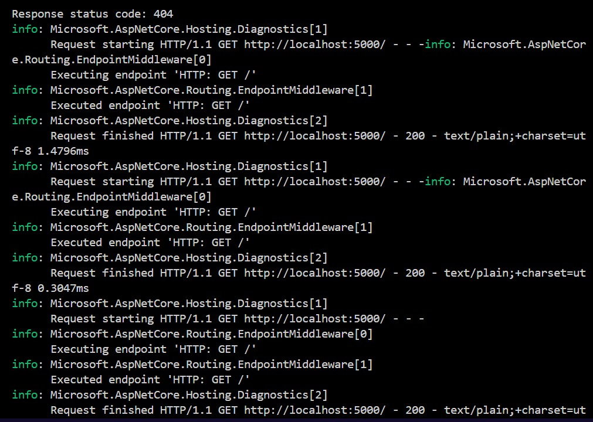

# Criando Métricas - Tutorial

Este repositório contém um exemplo  de como criar e testar métricas em uma aplicação .NET.

## Conceitos Aprendidos

- Utilização de métricas personalizadas em uma aplicação .NET.
- Uso do `MetricCollector<T>` para registrar e testar medições de instrumentos específicos.
- Teste de métricas utilizando injeção de dependência e um objeto `IMeterFactory`.
- Teste de métricas sem injeção de dependência usando um objeto global compartilhado `Meter`.
- Utilização do comando `dotnet run` para compilar e executar um projeto .NET.

## Estrutura do Projeto

A estrutura do projeto foi organizada da seguinte maneira:

```
.
├── assets                # Diretório contendo imagens
├── bin                   # Diretório onde são armazenados os arquivos binários gerados durante a compilação
├── docs            # Arquivo markdown principal
├── .gitattributes        # Arquivo que configura como o Git deve tratar determinados arquivos e diretórios
├── criando-metricas.csproj  # Arquivo de projeto do Visual Studio para a solução
├── obj                   # Diretório onde são armazenados os arquivos intermediários gerados durante a compilação
├── metricas.cs           # Arquivo de código-fonte contendo a implementação das métricas
├── metricas.sln          # Arquivo de solução do Visual Studio
└── program.cs            # Arquivo de código-fonte contendo a implementação principal da aplicação
```

## Execução do Projeto

Para executar o projeto, siga os passos abaixo:

1. Certifique-se de ter o SDK do .NET instalado em seu sistema.
2. Navegue até o diretório onde está localizado o arquivo `program.cs`.
3. Execute o comando `dotnet run` para compilar e executar a aplicação.

## Exemplo de Execução do Projeto

Aqui está alguns exemplos   de como executar o projeto com prints:





## Contribuição

Sinta-se à vontade para contribuir com melhorias, correções de bugs ou novos recursos. Basta abrir uma issue ou enviar um pull request!


Essa documentação fornece uma visão geral e clara do projeto e detalha como executá-lo. 